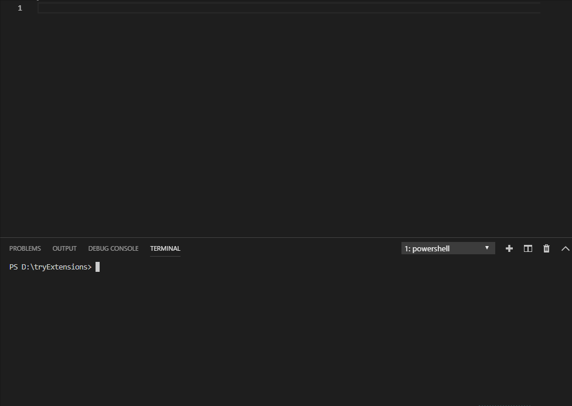

## Redis Snippet Pack for Visual Studio Code

##### A snippet pack to make you more productive working with redis commands for node js.



##### Here's the full list of all the snippets:

## Shortcuts / Commands

| Command | Description |
| --- | --- |
| geoadd | Add one or more geospatial items in the geospatial index represented using a sorted set  |
| geodist | Returns the distance between two members of a geospatial index |
| georadius | Query a sorted set representing a geospatial index to fetch members matching a given maximum distance from a point |
| geohash | Returns members of a geospatial index as standard geohash strings |
| geopos | Returns longitude and latitude of members of a geospatial index |
| georadiusbymember | Query a sorted set representing a geospatial index to fetch members matching a given maximum distance from a member |
| hdel | Delete one or more hash fields |
| hexists | Determine if a hash field exists |
| hget | Get the value of a hash field |
| hgetall | Get all the fields and values in a hash |
| hincrby | Increment the integer value of a hash field by the given number |
| hincrbyfloat | Increment the float value of a hash field by the given amount |
| hkeys | Get all the fields in a hash |
| hlen | Get the number of fields in a hash |
| hmget | Get the values of all the given hash fields |
| hmset | Set multiple hash fields to multiple values |
| hscan | Incrementally iterate hash fields and associated values |
| hset | Set the string value of a hash field |
| hsetnx | Set the value of a hash field, only if the field does not exist |
| hstrlen | Get the length of the value of a hash field |
| hvals | Get all the values in a hash |
| pfadd | Adds the specified elements to the specified HyperLogLog. |
| pfcount | Return the approximated cardinality of the set(s) observed by the HyperLogLog at key(s). |
| pfmerge | Merge N different HyperLogLogs into a single one. |
| del | Delete a key |
| dump | Return a serialized version of the value stored at the specified key. |
| exists | Determine if a key exists |
| expire | Set a key's time to live in seconds |
| expireat | Set the expiration for a key as a UNIX timestamp |
| keys | Find all keys matching the given pattern |
| move | Move a key to another database |
| object | Inspect the internals of Redis objects |
| persist | Remove the expiration from a key |
| pexpire | Set a key's time to live in milliseconds |
| pexpireat | Set the expiration for a key as a UNIX timestamp specified in milliseconds |
| pttl | Get the time to live for a key in milliseconds |
| randomkey | Return a random key from the keyspace |
| rename | Rename a key |
| renamenx | Rename a key, only if the new key does not exist |
| scan | Incrementally iterate the keys space |
| sort | Sort the elements in a list, set or sorted set |
| touch | Alters the last access time of a key(s). Returns the number of existing keys specified. |
| ttl | Get the time to live for a key |
| type | Determine the type stored at key |
| wait | Wait for the synchronous replication of all the write commands sent in the context of the current connection |
| blpop | Remove and get the first element in a list, or block until one is available |
| brpop | Remove and get the last element in a list, or block until one is available |
| lindex | Get an element from a list by its index |
| linsert | Insert an element before or after another element in a list |
| llen | Get the length of a list |
| lpop | Remove and get the first element in a list |
| lpush | Prepend one or multiple values to a list |
| lpushx | Prepend a value to a list, only if the list exists |
| lrange | Get a range of elements from a list |
| lrem | Remove elements from a list |
| lset | Set the value of an element in a list by its index |
| ltrim | Trim a list to the specified range |
| rpop | Remove and get the last element in a list |
| rpoplpush | Remove the last element in a list, prepend it to another list and return it |
| rpush | Append one or multiple values to a list |
| rpushx | Append a value to a list, only if the list exists |
| sadd | Add one or more members to a set |
| scard | Get the number of members in a set |
| sdiff | Subtract multiple sets |
| sdiffstore | Subtract multiple sets and store the resulting set in a key |
| sinter | Intersect multiple sets |
| sinterstore | Intersect multiple sets and store the resulting set in a key |
| sismember | Determine if a given value is a member of a set |
| smembers | Get all the members in a set |
| smove | Move a member from one set to another |
| spop | Remove and return one or multiple random members from a set |
| srandmember | Get one or multiple random members from a set |
| srem | Remove one or more members from a set |
| sscan | Incrementally iterate Set elements |
| sunion | Add multiple sets |
| sunionstore | Add multiple sets and store the resulting set in a key |
| zadd | Add one or more members to a sorted set, or update its score if it already exists |
| zcard | Get the number of members in a sorted set |
| zcount | Count the members in a sorted set with scores within the given values |
| zincrby | Increment the score of a member in a sorted set |
| zinterstore | Intersect multiple sorted sets and store the resulting sorted set in a new key |
| zlexcount | Count the number of members in a sorted set between a given lexicographical range |
| zrange | Return a range of members in a sorted set, by index |
| zrange | Return a range of members in a sorted set, by lexicographical range |
| zrangebyscore | Return a range of members in a sorted set, by score |
| zrank | Determine the index of a member in a sorted set |
| zrem | Remove one or more members from a sorted set |
| zremrangebylex | Remove all members in a sorted set between the given lexicographical range |
| zremrangebyrank | Remove all members in a sorted set within the given indexes |
| zremrangebyscore | Remove all members in a sorted set within the given scores |
| zrevrange | Return a range of members in a sorted set, by index, with scores ordered from high to low |
| zrevrangebylex | Return a range of members in a sorted set, by lexicographical range, ordered from higher to lower strings. |
| zrevrangebyscore | Return a range of members in a sorted set, by score |
| zrevrank | Determine the index of a member in a sorted set, with scores ordered from high to low |
| zscore | Get the score associated with the given member in a sorted set |
| zunionstore | Add multiple sorted sets and store the resulting sorted set in a new key |
| append | Append a value to a key |
| bitcount | Count set bits in a string |
| bitop | Perform bitwise operations between strings |
| bitpos | Find first bit set or clear in a string |
| on | Connect to redis database |
| decr | Decrement the integer value of a key by one |
| decrby | Decrement the integer value of a key by the given number |
| get | Get the value of a key |
| getbit | Returns the bit value at offset in the string value stored at key |
| getrange | Get a substring of the string stored at a key |
| getset | Set the string value of a key and return its old value |
| incr | Increment the integer value of a key by one |
| incrby | Increment the integer value of a key by the given amount |
| incrbyfloat | Increment the float value of a key by the given amount |
| mget | Get the values of all the given keys |
| mset | Set multiple keys to multiple values |
| psetex | Set the value and expiration in milliseconds of a key |
| set | Set the string value of a key |
| setbit | Sets or clears the bit at offset in the string value stored at key |
| setex | Set the value and expiration of a key |
| setnx | Set the value of a key, only if the key does not exist |
| setrange | Overwrite part of a string at key starting at the specified offset |
| strlen | Get the length of the value stored in a key |


### For example 

redis.set


```
client.set('mykey', 'Hello', function(err, res) {
  console.log(res); // OK
});

```

redis.get


```
client.get('mykey', function(err, res) {
  console.log(res); // Hello
});

```


## Release Notes

Users appreciate release notes as you update your extension.


## For more information

https://github.com/ylcnfrht/redisNode

https://github.com/NodeRedis/node_redis

https://redis.io/commands


### 1.0.0

Initial release of redis command snippets

### 1.0.1

Delete a unnecessary comment line 
-----------------------------------------------------------------------------------------------------------

